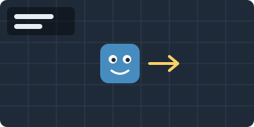

# gdMarkdown Guide

gdMarkdown renders your project's Markdown files inside the Godot editor. This guide covers only what gdMarkdown adds to standard Markdown. For help with standard Markdown, see the [Markdown reference](https://commonmark.org/help/).

- [Using the panel](#using-the-panel)
- [Editor icons](#editor-icons)
- [Links to Godot's docs](#links-to-godots-docs)
- [Links to project files](#links-to-project-files)
- [Links to headings](#links-to-headings)
- [Image sizes](#image-sizes)
- [Code blocks](#code-blocks)
- [Checklists](#checklists)
- [Limitations](#limitations)

Every example has a {icon:ActionCopy} button to copy it.

## Using the panel

| Control | What it does |
|---|---|
| {icon:Back} {icon:Forward} | Go back or forward through the pages and headings you've visited, like a web browser. Your mouse's side buttons do the same. |
| File dropdown | Lists every `.md` file in the project, including ones inside addons. This guide is at the bottom. |
| {icon:ImageTexture} | Opens the icon browser (see [Editor icons](#editor-icons)). |
| {icon:Help} | Opens this guide. |
| {icon:Reload} | Re-reads the file from disk. |

The page updates on its own when files change, and follows a file you rename or move in the FileSystem dock.

To edit a Markdown file, double-click it in the FileSystem dock to open it in the script editor.

To move the panel, drag its tab to any dock, or to the bottom panel.

## Editor icons

`{icon:Name}` shows an icon from the Godot editor inline, at text size.

```markdown
Click {icon:ScriptCreate} to attach a script, then press {icon:Play} to run.
```

Click {icon:ScriptCreate} to attach a script, then press {icon:Play} to run.

To find icon names, press {icon:ImageTexture} in the toolbar. Type to filter, then double-click an icon to copy its tag. Every node type has an icon named after its class: {icon:Node2D} `Node2D`, {icon:Sprite2D} `Sprite2D`, {icon:Label} `Label`.

For your own small images, use a path instead of a name: `{icon:images/my_button.svg}`.

A misspelled name shows in orange, like {icon:NotARealIcon}.

## Links to Godot's docs

Start a link target with `godot:` to open the editor's built-in class reference. It works offline and always matches your Godot version.

```markdown
A [Sprite2D](godot:Sprite2D) moves when you change its [position](godot:Sprite2D.position).
```

A [Sprite2D](godot:Sprite2D) moves when you change its [position](godot:Sprite2D.position).

| Write | Opens |
|---|---|
| `godot:Sprite2D` | A class |
| `godot:Label.text` | A property |
| `godot:SceneTree.quit()` | A method |
| `godot:Node._ready()` | A virtual method |
| `godot:Node.ready` | A signal |
| `godot:Vector2.UP` | A constant |
| `godot:Input.MouseMode` | An enum |
| `godot:print()`, `godot:KEY_SHIFT` | A global function or constant |
| `godot:@onready` | An annotation |

Inherited members open on the class that documents them, so `godot:Sprite2D.position` opens Node2D's page. For built-in types such as `Vector2` and `String`, end methods with `()`.

## Links to project files

Where a link opens depends on the file type:

| Link to | Opens |
|---|---|
| `.md` | In this panel |
| `.gd` | The script editor |
| `.tscn` | The scene |
| Anything else | Selected in the FileSystem dock |

Paths start from the folder of the current file. Use `res://` to reach anywhere in the project. Paths with spaces work as written, with `%20`, or inside `<angle brackets>`.

```markdown
[Next: Phase 2](phase2.md)
[Open the script](res://SpriteMoverGame.gd)
```

## Links to headings

Link to a heading with `#` and the heading's ID. Add a file name first to jump into another file.

```markdown
[Jump to Code blocks](#code-blocks)
[Phase 2, step 3](phase2.md#step-3)
```

[Jump to Code blocks](#code-blocks)

An ID is the heading text in lowercase, with spaces turned into hyphens and punctuation removed. These are the same IDs GitHub uses, so the links work there too.

| Heading | ID |
|---|---|
| `## Code blocks` | `code-blocks` |
| `### 1.2 Attach Script` | `12-attach-script` |
| `## What's next?` | `whats-next` |

If two headings have the same text, the second one gets `-1` added, the third `-2`, and so on.

## Image sizes

Images display at their natural size, and shrink to fit when the panel is narrower. They're never stretched larger. Hover over an image to see its alt text.

To choose a size, add `{width=...}` after the image, or use an HTML `` tag, which GitHub also understands. Sizes can be pixels or a percentage of the panel width. Set only a width or only a height to keep the image's shape.

```markdown
{width=150}

```

{width=150}


Tips:

- Screenshots taken on a Retina Mac have twice the pixels they appear to have, so they show up large. Add a width such as `{width=50%}`.
- Godot doesn't draw text inside SVG files. Use PNG for diagrams with labels.

## Code blocks

The {icon:ActionCopy} button copies the code exactly as written, tabs included, so pasted GDScript keeps valid indentation.

To put a code block inside a numbered step, indent its lines with one <kbd>Tab</kbd>. The block lines up under the step, and the numbering continues after it.

To show an example that contains three backticks, wrap it in four:

````markdown
```gdscript
func _ready() -> void:
	print("Hello, world!")
```
````

## Checklists

Click a checkbox in a task list to check or uncheck it. The Markdown file is updated to match.

```markdown
- [x] Print a message
- [ ] Quit with Escape
```

- [x] Print a message
- [x] Quit with Escape

Try the boxes above. In this guide they only change on screen.

If the file is open in the script editor with unsaved changes, the panel shows your unsaved text, with a note at the top, and a click changes the text in the script editor instead of the file. Save as usual, or undo the click there with <kbd>Command</kbd>+<kbd>Z</kbd>.

## Limitations

gdMarkdown doesn't support HTML other than `<kbd>` and ``, footnotes, or lists and code blocks inside table cells.
